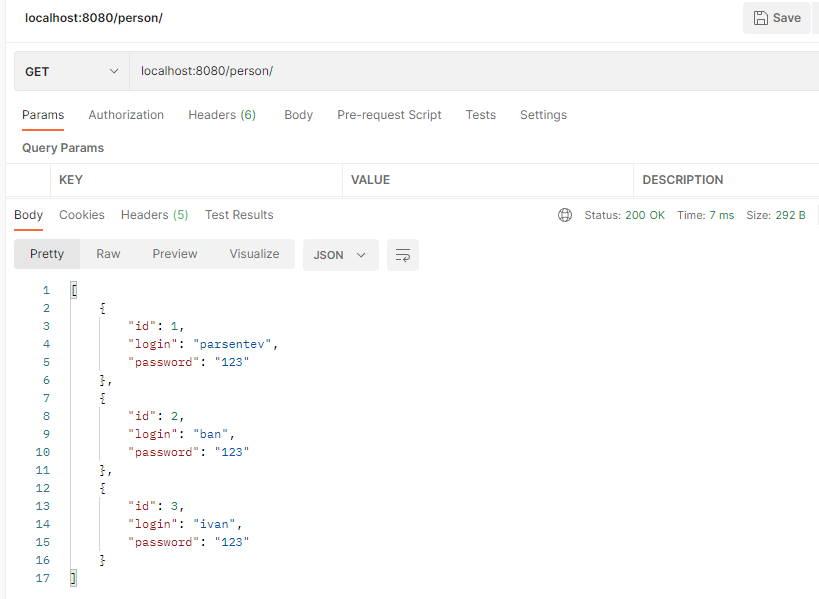
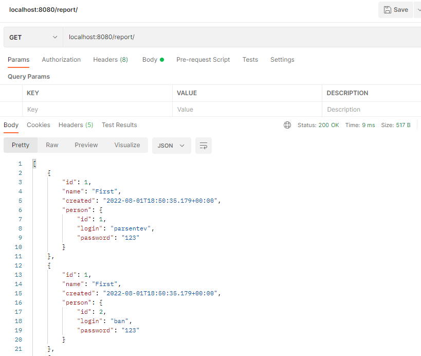

# job4j_rest

## Описание проекта
Spring Boot проект с демонстрацией работы Rest сервиса через RestTemplate.

# Функционал:
- Создание пользователей.
- Получение списка пользователей.
- Получение пользователя по id.
- Редактирование пользователя.
- Удаление пользователей.

# Применяемые технологии:
* Java 14
* Spring Boot, Spring Data, Spring Test
* PosgreSQL, Liquibase
# Применяемые инструменты:
* Maven, Checkstyle, Travis CI

## Сборка и запуск:
Для выполнения действий данного раздела необходимо установить
и настроить систему сборки проектов Maven.

По умолчании проект компилируется и собирается в директорию target.

## 1. Сборка проекта.
Команда для сборки в jar
`mvn clean package -DskipTests`

### 2. Запуск проекта.
Команда для запуска
`java -jar target/auth-1.0.jar`

## Примеры работы:
Все действия в проекте возможны с использованием PersonController
и ReportController вызывающего PersonController через RestTemplate.
### 1. Работа с PersonController.
* GET/person/ список всех пользователей.
* GET/person/{id} - пользователь с id.
* POST/person/ - создает пользователя.
* PUT/person/ - обновляет пользователя.
* DELETE/person/{id} - удаляет.

Пример:

### 2. Работа с ReportController.
* GET/report/ список всех пользователей.
* GET/report/{id} - пользователь с id.
* POST/report/ - создает пользователя.
* PUT/report/ - обновляет пользователя.
* DELETE/report/{id} - удаляет.
ReportController может оборачивать отчетные данные
от PersonController в свои данные, добавлять номер
отчета и время.

Пример:

## TODO list
* Реализовать EmployeeController - владельца пользователей.

## Контакты

&nbsp;&nbsp;
&nbsp;&nbsp;

